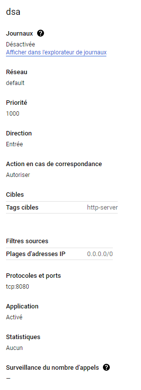
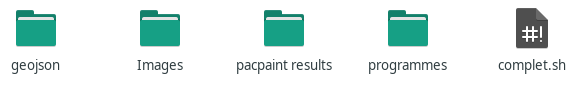
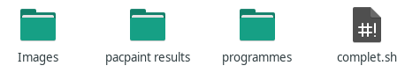

===========================================
Utilisation des programmes
===========================================

Installation de Digital Slide Archive
-------------------------------------

Digital Slide Archive (DSA) est un logiciel utilisé pour visualiser les lames.
L'installation faite est celle conseillée par DSA :
::
    sudo apt-get update
    sudo apt-get install git docker.io python-pip
    sudo usermod -aG docker `id -u -n`
    newgrp docker
    sudo pip install docker
    git clone https://github.com/DigitalSlideArchive/digital_slide_archive
    cd digital_slide_archive/ansible
    python deploy_docker.py start
    
Pour accéder ensuite à DSA sur le serveur Google Cloud distant, il faut d'abord ajouter un erègle de pare-feu pour le port 8080 :
::
    console.google.com -> Mise en réseau -> Réseau VPC -> Pare-feu -> Créer une règle pare-feu 
   
Mettre les paramètres suivants :

   
Et enfin, l'accès se trouve à l'addresse : http://IP.de.la.VM:8080.

Pour installer le pacquet python HistomicsTK, il suffit de lancer la commande :
::
    python3 -m pip install histomicstk --find-links https://girder.github.io/large_image_wheels

Génération des fichiers d'annotations pour QuPath
-------------------------------------------------
Le programme *complet.sh* dans le dossier **Annotations_QuPath** est le programme qui va générer les fichiers d'annotations GeoJSON utilisés par QuPath, ainsi que les fichiers script groovy qui vont importer les fichiers GeoJSON dans le logiciel.

Le programme fonctionne sur n'importe quel machine tant qu'il est lancé à partir d'un terminal compatible avec les commandes Linux et tant que la hiérarchie du dossier **Annotations_QuPath** est inchangée.

Avant de lancer le programme, il faut placer les slides analysées par PACpAInt dans un dossier **Images** et les résultats de l'analyse dans un dossier **pacpaint results** en les laissant dans leurs dossiers respectifs :

   
Le dossier **programmes** contient les programmes Python qui généreront les fichiers GeoJSON et groovy ; ces derniers seront aussi dans ce dossier. Les fichiers GeoJSON seront quant à eux dans le dossier **geojson**.

Enfin, pour lancer le programme, il suffit de lancer le programme *complet.sh* dans un terminal ; par exemple, lorsque l'on se trouve dans le même dossier que le fichier :
::
    ./complet.sh

Les scripts groovy sont alors exécutables depuis QuPath, que ce soit pour une image particulière ou pour l'ensemble d'un projet.

Téléversements des images et génération d'annotations sur DSA
-------------------------------------------------------------
Le programme *complet.sh* dans le dossier **Annotations_DSA** est le programme qui va téléverser des images et des dossiers GeoJSON dans DSA.

Le programme fonctionne dans n'importe quelle machine tant qu'il est lancé à partir d'une terminal compatible avec les commandes Linux et tant que la hiérarchie du dossier **Annotations_DSA** est inchangée.

Avant de lancer le programme, il faut placer les slides analysées par PACpAInt dans un dossier **Images** et les résultats de l'analyse dans un dossier **pacpaint results** en les laissant dans leurs dossiers respectifs :

  
Le dossier **programmes** contient les programmes Python qui validera l'authentification à l'API de DSA, qui téléverseront les slides et généreront les annotations.

Enfin, pour lancer le programme, il suffit de lancer le programme *complet.sh* dans un terminal ; par exemple, lorsque l'on se trouve dans le même dossier que le fichier :
::
    ./complet.sh
    
Il suffit alors de suivre les instructions qui apparaissent sur le terminal.
